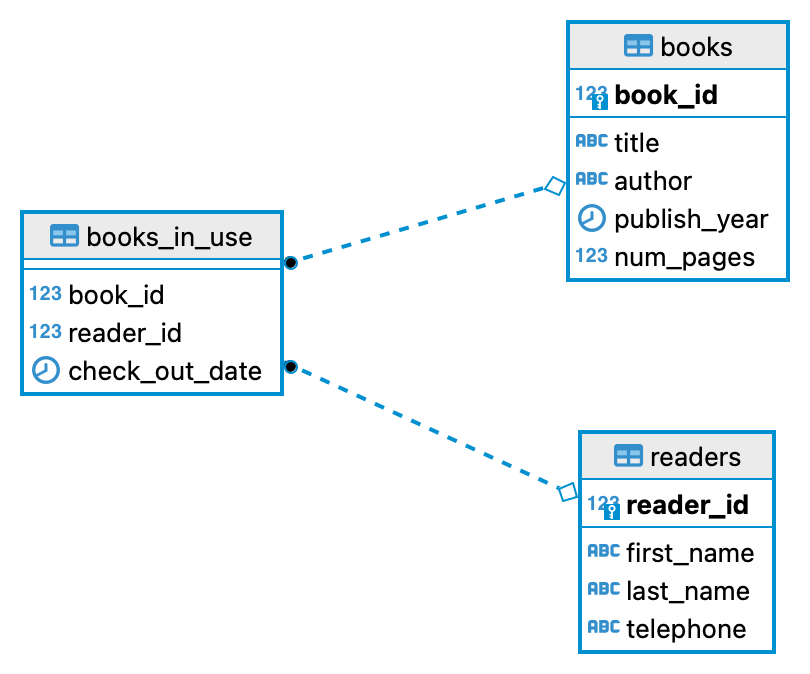

# What is this all about?
This article describes how to document a relational database using PostgreSQL as an example. The whole article consists of the following two steps:  
**Step 1**. Creating sample tables using PostgreSQL.  
**Step 2**. Documenting the sample tables.  
This article covers the very basics of database documentation.

:::tip
If you are new to relational databases, check [this article](https://cloud.google.com/learn/what-is-a-relational-database) by Google or [this article](https://en.wikipedia.org/wiki/Relational_database) on Wikipedia.
:::

## Step 1. Creating sample tables using PostgresSQL
If you're not interested, you can skip ahead to Step 2. Documenting the sample tables.
Let's create a sample database with a couple of tables that will serve as an example for our database dictionary.

### Prerequisites
If you want to test this step on your local machine, you will need the following:
1. Install PostgreSQL -- visit [postgresql.org](https://www.postgresql.org) for installation instructions.
2. Install a SQL client. For example, [pgAdmin](https://www.pgadmin.org), which is free just like PostgreSQL itself. Another option is [DBeaver](https://dbeaver.io), which has a free Community version.

## Create a new database

## Create tables

## ERD

DBeaver uses [IDEF1X](https://en.wikipedia.org/wiki/IDEF1X) notation by default, other notations are not supported as of this writing.
You can use other database modeling tools that support other notations. For example, [Crow's foot notation](https://en.wikipedia.org/wiki/Entity–relationship_model#Crow's_foot_notation) is widely used in database modelling.  
The ERD for our library tables may look as follows (IDEF1X notation).

### Insert an image using Markdown syntax

### Insert an image using JSX
For details, see [Static Assets](https://docusaurus.io/docs/static-assets).

## Database dictionary structure
Database dictionaries usually consist of the following sections. Click on a section name to go to a detailed description.
- Database overview
- Entity relationship diagram
- Tables
- Views (optional)
- Stored procedures (optional)

### Database overview
Provide general information about the database: name (both logical and physical if they are different), business purpose, important notes?

### Entity relationship diagram

### Tables
Each table description includes:
- Table name
- Table description (business or functional purpose)
- Indexes (optional)
- Column names (or fields)
- Column attributes:
    - Data type
    - Nullable (Yes/No)
    - Column description (business or functional purpose)

### Views (optional)

### Stored procedures (optional)
